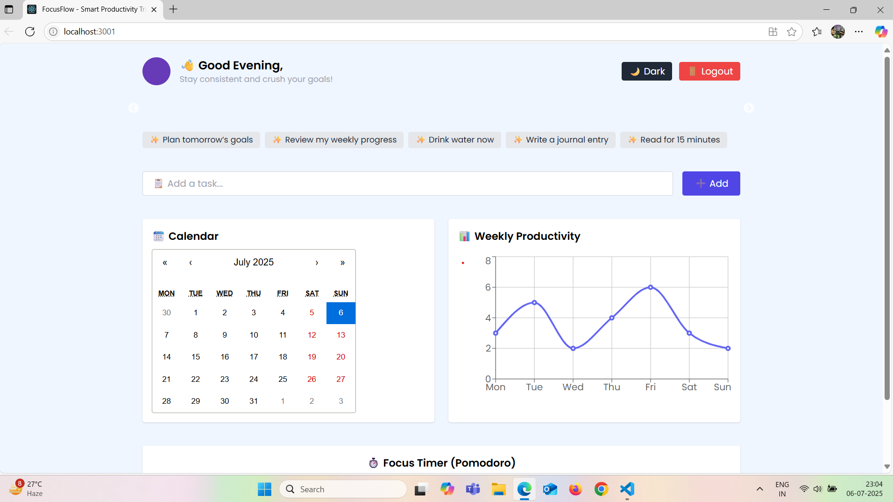
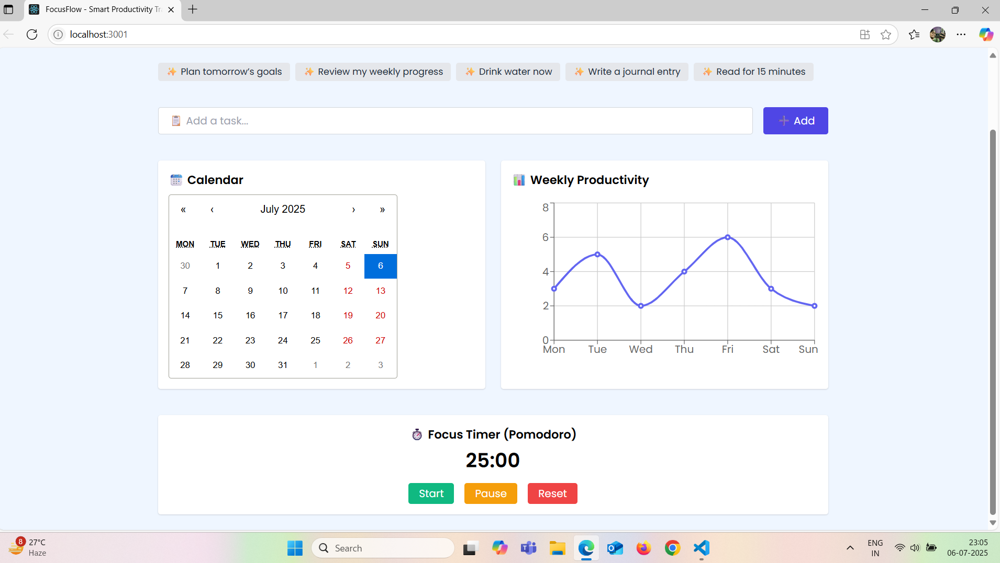
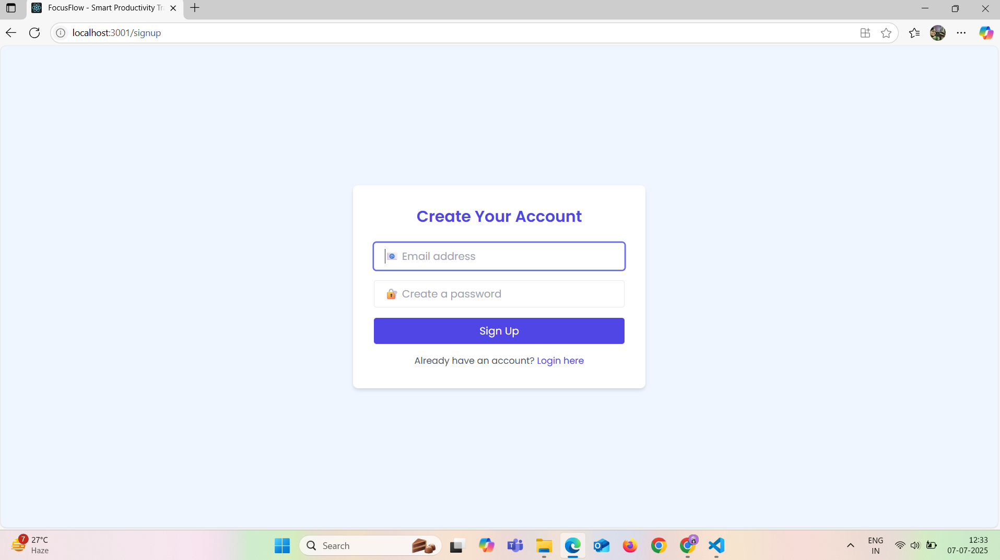
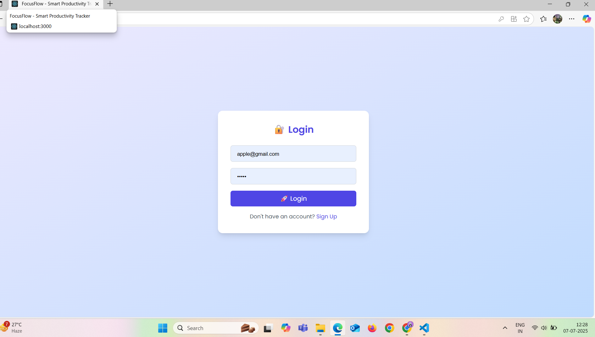

# 🚀 FocusHive – Smart Productivity Tracker

A full-stack MERN-based productivity tracker to manage tasks, visualize progress, and boost productivity with clean analytics and smart features.

---

## 🌐 Live Links

- 🖥️ Frontend (Client): [https://smart-frontend.onrender.com](https://smart-frontend.onrender.com)
- ⚙️ Backend (API): [https://smart-productivity-tracker.onrender.com](https://smart-productivity-tracker.onrender.com)

---

## 📸 Screenshots

### 🌞 Dashboard (Light Mode)


### ⏱️ Pomodoro Timer View


### 🧾 Signup Page


### 🔑 Login Page


---

## ✨ Features

- 🔐 JWT-Based Authentication (Signup/Login)
- 📅 Add, Edit, Delete Tasks with Deadlines
- 📈 Dashboard with Weekly Analytics (Recharts)
- ⏱️ Pomodoro Timer Integration for Focus
- 🗓️ Calendar View for Task Planning
- 💾 MongoDB for persistent storage
- 🎨 Responsive UI using TailwindCSS
- ☁️ Deployed on Render (Backend) & Render Static Site (Client)

---

## ⚙️ Tech Stack

- **Frontend:** React.js, TailwindCSS, Axios
- **Backend:** Node.js, Express.js, MongoDB, Mongoose
- **Auth:** JWT, bcryptjs
- **Charts:** Recharts
- **Deployment:** Render (Backend), Render Static Site (Client)

---

## 🧩 Project Structure

```

FocusHive/
├── client/          # React Frontend
│   └── src/
│       └── pages/
│       └── components/
├── backend/         # Express Backend
│   ├── routes/
│   ├── controllers/
│   ├── models/
│   └── index.js
├── assets/          # Screenshots, Images
├── .env.example     # Environment variable template
└── README.md

````

---

## 💻 Setup Locally

```bash
git clone https://github.com/meghana5226/FocusHive.git
cd FocusHive
````

---

### 🛠️ Setup Backend

```bash
cd backend
npm install
```

Create a `.env` file in `/backend`:

```env
PORT=5000
MONGO_URI=your_mongodb_connection_string
JWT_SECRET=your_jwt_secret_key
```

Run the server:

```bash
node index.js
```

Server runs at: `http://localhost:5000`

---

### 🎨 Setup Frontend

```bash
cd ../client
npm install
npm start
```

Client runs at: `http://localhost:3000`

---

## 🔐 Environment Variables

Create a `.env` file in the `backend` folder using this template:

```
# .env

PORT=5000
MONGO_URI=your_mongo_connection_string
JWT_SECRET=your_jwt_secret_key
```

---

## 👩‍💻 Author

**Bommishetti Meghana**
🔗 GitHub: [@meghana5226](https://github.com/meghana5226)
📧 Email: [bommishettimeghana5226@gmail.com](mailto:bommishettimeghana5226@gmail.com)


